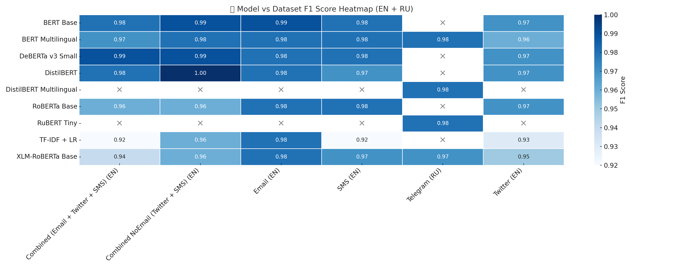

# 📦 SpamFilter — Multilingual Spam Classification Toolkit

**SpamFilter** — is a modular Python toolkit for building, training, and evaluating spam classifiers using traditional (TF-IDF + LogisticRegression) and transformer-based (BERT, RoBERTa, etc.) models. It includes built-in benchmarking, diagnostics, and utilities.

## Functionality

- Text classification into `1` and `0` as `spam` and `not spam` respectively
- Support for different models: TF-IDF + Logistic Regression (out of the box), BERT based models, any HugginFace model. (Included pretrained models: TF-IDF + Logistic Regression, DeBERTa v3 small, DistilBERT, RuBERT)
- Training, evaluating and benchmarking of models out of the box
- Supports training on user data
- Prediction, probabilities, evaluation, saving/loading
- Supports CUDA (if available) for processing

All datasets used for training the prepaired models, are listed in folder "datasets". In the sections below you will find brief descriptions of them, as well as their preparation code and comparison of models.


## 🔧 Installation

If you are developing or testing this project locally, you can install it as an editable package:

```bash
git clone https://github.com/yourusername/spamfilter.git
cd spamfilter
pip install -e .
```

This allows you to import `spam_detector` directly and reflect live changes in your environment.

---


You can install dependencies using:

```bash
pip install -r requirements.txt
```

Or manually:

```bash
pip install torch transformers scikit-learn pandas datasets matplotlib seaborn
```


## 🚀 Usage

### ✅ Supported Models

- `TF-IDF + LogisticRegression` (lightweight baseline)
- Pretrained HuggingFace models:
  - `distilbert-base-uncased`
  - `bert-base-uncased`
  - `microsoft/deberta-v3-small`
  - `xlm-roberta-base`
  - `cointegrated/rubert-tiny`, etc.
- You can load your own HuggingFace model via `Detector.custom(...)`

---

### 📦 Initializing a Detector

```python
from spam_detector import Detector

clf = Detector("tfidf")  # Fast traditional model
clf = Detector("distilbert")  # Pretrained transformer, which must be is saved in "models" folder

# Load a custom model from HuggingFace
clf = Detector.custom("cointegrated/rubert-tiny", save_as="rubert_tiny")
```

---

### 🧠 Training a Model

```python
clf.train(texts, labels)  # Simple training

# With validation
clf.train(
    texts, labels,
    eval_texts=X_val,
    eval_labels=y_val
)
```

---

### 📈 Model Evaluation

```python
clf.evaluate(X_test, y_test)
```

Outputs accuracy, confusion matrix, precision/recall/F1 scores.

---

### 🔍 Inference

```python
clf.predict("Congratulations, you won!")
clf.predict_batch(["Hello!", "Win a free iPhone now!"])
```

---

### 📊 Getting Prediction Confidence

You can return both the predicted label and the confidence score:

```python
clf.predict("Win a free prize!", return_proba=True)
# {'label': 1, 'score': 0.987}

clf.predict_batch(["Hi", "Limited offer!"], return_proba=True)
# [{'label': 0, 'score': 0.993}, {'label': 1, 'score': 0.978}]
```

The `return_proba=True` flag works for all model types (TF-IDF or Transformers).

---

### 💾 Saving and Loading Models

```python
clf.save("models/<model_name>")  # Saves to models/<model_name>
clf.load("models/<model_name>")  # Loads from the same folder
```

---

### 📊 Benchmark Inference Speed

```python
clf.benchmark(texts)  # Measures prediction time in seconds
```

---

### 🛠 Utilities

```python
from utils import diagnostic_report, free_gpu

diagnostic_report(texts, labels)  # Shows sample size, label counts, avg length, memory usage etc.
free_gpu()  # Clears CUDA memory
```

---

### 📚 Model Management

```python
Detector.list_models()  # List available models in /models
Detector.is_model_available("rubert")  # Check if model exists in "models" folder
```

---

## 📌 Example (full cycle)

```python
clf = Detector("xlm-roberta")

clf.train(X_train, y_train, eval_texts=X_test, eval_labels=y_test)

clf.evaluate(X_test, y_test)
predictions = clf.predict_batch(X_test[:10])
```

---


## Datasets

<details>
  <summary>Data description</summary
  
Initial set of datasets consists of:
- **SMS** dataset. Available on: [Kaggle](https://www.kaggle.com/datasets/uciml/sms-spam-collection-dataset).
- `Processed dataset used for training is: processed_sms.csv`

Example of content:


<br/>

- **Twitter** dataset. Available on: [Kaggle](https://www.kaggle.com/datasets/greyhatboy/twitter-spam-dataset)
- `Processed dataset used for training is: processed_twitter.csv`

Example of content:


<br/>

- **Email** dataset. Available on: [Kaggle](https://www.kaggle.com/datasets/jackksoncsie/spam-email-dataset)
- `Processed dataset used for training is: processed_email.csv`

Example of content:


<br/>

- **Combined** dataset. (Joined together Email + Twitter + SMS spam datasets)

Example of content:


<br/>

- **Combined NoEmail** dataset. (Joined together Twitter + SMS spam datasets)

Example of content:


<br/>

- **Telegram** dataset. (Manually collected spam + normal messages on ru language)

Example of content:


<br/>

</details>

<details>
<summary>Data preparation</summary>

Before using datasets we need to unify their structure, for this I used the following code:

`SMS`
```python
import pandas as pd

df_sms = pd.read_csv("drive/MyDrive/ml_data/sms_dataset.csv", encoding="latin-1")
df_sms = df_sms[['v1', 'v2']]
df_sms.columns = ['label', 'message']
df_sms['label'] = df_sms['label'].map({'ham': 0, 'spam': 1})
df_sms.head()
```

`TWITTER`
```python
import pandas as pd

df_twitter = pd.read_csv("drive/MyDrive/ml_data/twitter_dataset.csv", encoding="latin-1")
df_twitter = df_twitter[['class', 'tweets']]
df_twitter.columns = ['label', 'message']
df_twitter.head()
```

`EMAIL`

Email dataset is a little bit harder to use, as the other ones. The reason for that is an apsence of formatting. At all.
Message text can contain Subject:, To:, Date: and other fields, which is a big noise for simple classification and even BERTa like models too.
To fix it, I used a simple cleaning code to remove all unnecessary text pieces. (It costed a text sence in some messages, but it is better than nothing)

Here is the code I used to cleanup Email dataset:
```python
import pandas as pd
import re

df_email = pd.read_csv("drive/MyDrive/ml_data/emails_dataset.csv", encoding="latin-1")

def clean_email_text(text: str) -> str:
    text = re.sub(r'^(Subject|From|To|Date)\s*:\s*', '', text) # Removing frequent texts
    text = re.sub(r'<[^>]+>', '', text) # Remove HTML tags too
    text = re.sub(r'[^a-z0-9\s\.\,\!\?\:\-]', ' ', text) # Remove any unnecessary symbol
    text = re.sub(r'\s+', ' ', text) # Merge multiple spaces into one
    text = text.strip()
    return text

df_email = df_email[['spam', 'text']]
df_email.columns = ['label', 'message']
df_email['message'] = df_email['message'].apply(clean_email_text)
df_email.head()
```

</details>


## Models Evaluation Report

In order to compare how each model performs on different data, I created and ran a benchmark, which different datasets and different popular models.\
Below I provide a summaary tables for all tests. If you want to run tests by yourself, you can use `benchmark.py` script in folder `tests`.

Datasets used for testing:
- Combined `(sombined_dataset.csv)`
- Combined NoEmail `(combined_noemail_dataset.csv)`
- Twitter `(processed_twitter.csv)`
- SMS (processed_sms.csv)
- Email `(processed_email.csv)`.

<br/>

`Importants notice: All datasets contain ONLY english messages`\
`TF-IDF + Logistic Regression was set with parameter class_weight='balanced', in order to compensate inbalance in datasets`

<br/>

**Time** - shows how long it took a model to predict a batch of messages. Which is the whole test array.\

`Why not just a few messages?`
- Because in this way we can see, how (probably) the model will handle a big amount of data at once. For example if we need to procees messages in chat in a pack. And also, if you will test models on a 2-3 messages, time differences can be small to show anything.

<details>
  <summary>English Datasets</summary>

### BERT Base
| Dataset                          |   Accuracy |   Recall (Spam) |   Precision (Spam) |   F1 (Spam) |   FP |   FN |   Time (s) |
|:---------------------------------|-----------:|----------------:|-------------------:|------------:|-----:|-----:|-----------:|
| Combined (Email + Twitter + SMS) |     0.9941 |            0.97 |               0.99 |        0.98 |    4 |   16 |         29 |
| Combined NoEmail (Twitter + SMS) |     0.9978 |            0.99 |               1    |        0.99 |    1 |    4 |         16 |
| SMS                              |     0.9937 |            0.97 |               0.99 |        0.98 |    2 |    5 |          8 |
| Twitter                          |     0.991  |            0.95 |               0.98 |        0.97 |    3 |    7 |          8 |
| Email                            |     0.9948 |            0.98 |               1    |        0.99 |    0 |    6 |         14 |

---

### BERT Multilingual
| Dataset                          |   Accuracy |   Recall (Spam) |   Precision (Spam) |   F1 (Spam) |   FP |   FN |   Time (s) |
|:---------------------------------|-----------:|----------------:|-------------------:|------------:|-----:|-----:|-----------:|
| Combined (Email + Twitter + SMS) |     0.9887 |            0.96 |               0.97 |        0.97 |   17 |   21 |         29 |
| Combined NoEmail (Twitter + SMS) |     0.9942 |            0.98 |               0.98 |        0.98 |    6 |    7 |         15 |
| SMS                              |     0.9946 |            0.97 |               0.99 |        0.98 |    2 |    4 |          8 |
| Twitter                          |     0.9901 |            0.96 |               0.97 |        0.96 |    5 |    6 |          8 |
| Email                            |     0.9895 |            0.97 |               0.99 |        0.98 |    3 |    9 |         14 |

---

### DeBERTa v3 Small
| Dataset                          |   Accuracy |   Recall (Spam) |   Precision (Spam) |   F1 (Spam) |   FP |   FN |   Time (s) |
|:---------------------------------|-----------:|----------------:|-------------------:|------------:|-----:|-----:|-----------:|
| Combined (Email + Twitter + SMS) |     0.9956 |            0.98 |               0.99 |        0.99 |    5 |   10 |         34 |
| Combined NoEmail (Twitter + SMS) |     0.9973 |            0.99 |               0.99 |        0.99 |    2 |    4 |         19 |
| SMS                              |     0.9937 |            0.97 |               0.99 |        0.98 |    2 |    5 |         10 |
| Twitter                          |     0.9928 |            0.97 |               0.98 |        0.97 |    3 |    5 |         10 |
| Email                            |     0.9913 |            0.97 |               1    |        0.98 |    1 |    9 |         14 |

---

### DistilBERT
| Dataset                          |   Accuracy |   Recall (Spam) |   Precision (Spam) |   F1 (Spam) |   FP |   FN |   Time (s) |
|:---------------------------------|-----------:|----------------:|-------------------:|------------:|-----:|-----:|-----------:|
| Combined (Email + Twitter + SMS) |     0.9941 |            0.98 |               0.99 |        0.98 |    7 |   13 |         16 |
| Combined NoEmail (Twitter + SMS) |     0.9991 |            0.99 |               1    |        1    |    0 |    2 |          8 |
| SMS                              |     0.9919 |            0.97 |               0.97 |        0.97 |    4 |    5 |          4 |
| Twitter                          |     0.991  |            0.95 |               0.99 |        0.97 |    2 |    8 |          4 |
| Email                            |     0.9913 |            0.98 |               0.99 |        0.98 |    3 |    7 |          8 |

---

### RoBERTa Base
| Dataset                          |   Accuracy |   Recall (Spam) |   Precision (Spam) |   F1 (Spam) |   FP |   FN |   Time (s) |
|:---------------------------------|-----------:|----------------:|-------------------:|------------:|-----:|-----:|-----------:|
| Combined (Email + Twitter + SMS) |     0.9881 |            0.96 |               0.97 |        0.96 |   19 |   21 |         30 |
| Combined NoEmail (Twitter + SMS) |     0.9906 |            0.96 |               0.97 |        0.96 |    9 |   12 |         16 |
| SMS                              |     0.9946 |            0.97 |               0.99 |        0.98 |    2 |    4 |          8 |
| Twitter                          |     0.9928 |            0.95 |               0.99 |        0.97 |    1 |    7 |          8 |
| Email                            |     0.9913 |            0.97 |               1    |        0.98 |    1 |    9 |         14 |

---

### TF-IDF + LR
| Dataset                          |   Accuracy |   Recall (Spam) |   Precision (Spam) |   F1 (Spam) |   FP |   FN |   Time (s) |
|:---------------------------------|-----------:|----------------:|-------------------:|------------:|-----:|-----:|-----------:|
| Combined (Email + Twitter + SMS) |     0.9742 |            0.93 |               0.92 |        0.92 |   48 |   39 |          2 |
| Combined NoEmail (Twitter + SMS) |     0.9888 |            0.95 |               0.96 |        0.96 |   12 |   13 |          1 |
| SMS                              |     0.9785 |            0.93 |               0.91 |        0.92 |   13 |   11 |          1 |
| Twitter                          |     0.9812 |            0.94 |               0.92 |        0.93 |   12 |    9 |          1 |
| Email                            |     0.9895 |            0.99 |               0.97 |        0.98 |    9 |    3 |          1 |

---

### XLM-RoBERTa Base
| Dataset                          |   Accuracy |   Recall (Spam) |   Precision (Spam) |   F1 (Spam) |   FP |   FN |   Time (s) |
|:---------------------------------|-----------:|----------------:|-------------------:|------------:|-----:|-----:|-----------:|
| Combined (Email + Twitter + SMS) |     0.979  |            0.92 |               0.95 |        0.94 |   28 |   43 |         31 |
| Combined NoEmail (Twitter + SMS) |     0.9897 |            0.93 |               0.99 |        0.96 |    3 |   20 |         16 |
| SMS                              |     0.9928 |            0.97 |               0.98 |        0.97 |    3 |    5 |          8 |
| Twitter                          |     0.9857 |            0.93 |               0.97 |        0.95 |    5 |   11 |          8 |
| Email                            |     0.9887 |            0.96 |               0.99 |        0.98 |    2 |   11 |         15 |

</details>

<details>
  <summary>Russian Datasets</summary>

### BERT Multilingual
| Dataset   |   Accuracy |   Recall (Spam) |   Precision (Spam) |   F1 (Spam) |   FP |   FN |   Time (s) |
|:----------|-----------:|----------------:|-------------------:|------------:|-----:|-----:|-----------:|
| Telegram  |     0.9821 |            0.98 |               0.98 |        0.98 |   24 |   35 |         26 |

---

### RuBERT Tiny
| Dataset   |   Accuracy |   Recall (Spam) |   Precision (Spam) |   F1 (Spam) |   FP |   FN |   Time (s) |
|:----------|-----------:|----------------:|-------------------:|------------:|-----:|-----:|-----------:|
| Telegram  |     0.9821 |            0.98 |               0.98 |        0.98 |   28 |   31 |         11 |

---

### XLM-RoBERTa Base
| Dataset   |   Accuracy |   Recall (Spam) |   Precision (Spam) |   F1 (Spam) |   FP |   FN |   Time (s) |
|:----------|-----------:|----------------:|-------------------:|------------:|-----:|-----:|-----------:|
| Telegram  |     0.9746 |            0.96 |               0.99 |        0.97 |   23 |   61 |         25 |

</details>


## Visualizations

### Metric Comparison

I used only one RU dataset and only 3 models that support this language, so the bars for RU models can be not very representetive.\
HOWEVER, it still a valuable data and I couldn't throw it away.

`Important: During benchmarking, datasets were manually splitted into train and test parts, in fraction of 80/20 to avoid overfitting.`\
`You can see it in benchmark.py if you want.`

`I am not guarantee that these tests are 100% accurate, it is just data I gethered.`

<br/>

The first picture show the distribution of F1 score across datasets.


<br/>

This graph visually shows how differently models handled datasets.



<br/>

Here we add a time value into consideration.


## Findings

- **Email dataset** as a standalone data source shows pretty good results, even the best. But the combination of it with others, creates a slight noise.
- **Combination of datasets** improves the scores. Maybe because of samples amount, or a data diversity, not sure.
- **BERT models** show better results than Logistic Regression (which is obvoius), but it depends on the data and a model iself. RoBERTa showed itself worse, despite being BERT family model like others.
- **Liveness of messages** have a bigger impact on models (Except Regression). We can see it on SMS dataset, but it depends. Interesting why Twitter was worse than SMS.
- **Time combination** shows pretty obvious thing, but Logistic Regression seem to be over excited :)

---


## Recommendation

- **TF-IDF + LogisticRegression** remains a solid option, with a compromises. Use it if you need simple and fast solution, and ready to sacrifice accuracy.
- **DistilBERT** showed a great performance and accuracy. I will call it a mid tier solution.
- **Dataset** diversity and volume plays a vital role. I can recommend something between 5-10K of samples in total.
- **Classes distribution** is important but can be lowered, not lower than 80/20 proportion.

<br/>

`P.S. This validation was not a scientific research, it was a simple comparison on data I found and a test of a tool :)`
